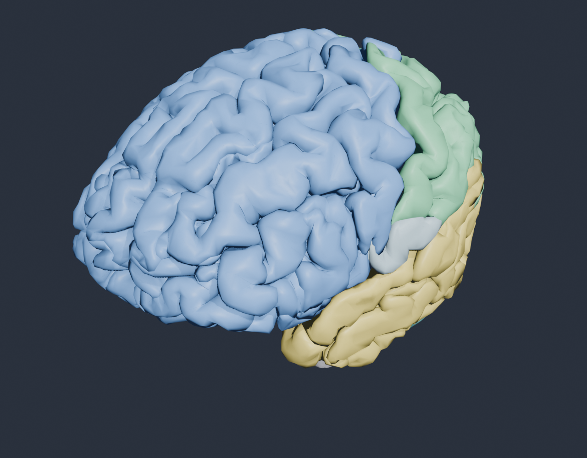

# NAVADA NeuroAtlas

**An interactive 3D brain learning platform** — explore, label and simulate how the brain responds, built around the **NAVADA_9** wearable-neurotechnology research concept.

> Part of the NAVADA Edge Network. Designed & developed by **Lee Akpareva, MBA, MA** — PhD Researcher, Wearable Neurotechnology, Brunel University of London.



---

## What it is

A real, anatomically segmented human brain you can rotate, take apart and study in the browser. Each of **32 curated structures** is individually named and described, colour-coded by functional system, and you can simulate how brain activity changes across everyday and clinical states.

## Features

- **Click-to-select + leader-line labels** — click any region (or pick from the list) to see its name, system and function, with a colour-matched callout line that tracks the part in 3D.
- **Explode / assemble** — pull the brain apart to reveal the deep structures; X-ray mode fades the cortex.
- **Activity simulation** — brain states (Resting, NAVADA_9 ErrP, Sleep Deprivation, Deep Focus) and everyday activities (Music, Exercise, Reading, Eating, Meditation, Stress). Involved regions flash, then a live heatmap shows what's suppressed vs overactive.
- **NAVADA_9 ErrP overlay** — the anterior cingulate fires and a signal pulse animates to a mastoid sensor node, visualising the closed loop.
- **Live telemetry** — simulated EEG/ErrP trace, neural frequency bands (δ θ α β γ), per-system activity bars, and NAVADA_9 readouts (ErrP status, classification confidence, feedback latency).
- **AI Tutor** — context-aware chat (knows your selected region + scenario), powered by NVIDIA NIM (Llama 3.3 70B). Key stays server-side.
- **Mobile / PWA** — installable, full-screen, safe-area aware; collapsible bottom-sheet UI on phones.
- **Axes / grid toggles**, search, About page.

## Run locally

```bash
# from this folder
python server.py
# open http://localhost:8099   (or http://127.0.0.1:8099)
```

The server serves the static app (no-cache, threaded) and exposes `GET /api/health` and `POST /api/chat` (AI proxy).

### AI Tutor configuration

Create a `.env` in this folder (gitignored — **never commit keys**):

```
NVIDIA_API_KEY=nvapi-...
NAVADA_TUTOR_MODEL=meta/llama-3.3-70b-instruct
```

Anthropic is also supported (`ANTHROPIC_API_KEY` + a `claude-*` model). The tutor shows "offline" until a key is present.

## Architecture

```
index.html ──> js/main.js (NavadaBrain orchestrator)
   ├─ SceneManager        Three.js scene / renderer
   ├─ LightingManager     lighting presets
   ├─ CameraController    OrbitControls
   ├─ BrainModel          loads models/brain_interactive.glb
   ├─ InteractionManager  raycast hover/click
   ├─ ExplodeManager      radial explode/assemble
   ├─ ActivityManager     heatmap, transitions, ErrP overlay, flash
   ├─ TelemetryManager    EEG/bands/system dashboards (canvas)
   └─ TutorManager        AI chat -> /api/chat
server.py                 static + NVIDIA/Anthropic proxy (threaded)
```

## The model pipeline

The brain is built from the open **Z-Anatomy** atlas, curated to 32 teaching structures:

```bash
# regenerate models/brain_interactive.glb from the Z-Anatomy atlas
blender -b /path/to/Z-Anatomy/Startup.blend --python build_brain_glb.py
# regenerate PWA icons from preview.png
python generate_icons.py
```

## Data & technology

- **Anatomy** — [Z-Anatomy](https://github.com/Z-Anatomy) (CC BY-SA 4.0) / BodyParts3D
- **3D engine** — Three.js / WebGL
- **AI Tutor** — NVIDIA NIM · Llama 3.3 70B
- **Concept** — Kim, S.-H. et al. *Wearable EEG electronics for a Brain–AI Closed-Loop System.* npj Flexible Electronics 6, 32 (2022).

## Licence & attribution

App code: see `LICENSE`. The anatomical geometry derives from Z-Anatomy and is **CC BY-SA 4.0** — attribution and share-alike apply to the model assets.

> Activity simulations are scientifically-informed dramatisations for learning, **not** biophysical simulations or measured device output.

See [BACKLOG.md](BACKLOG.md) for planned work.
